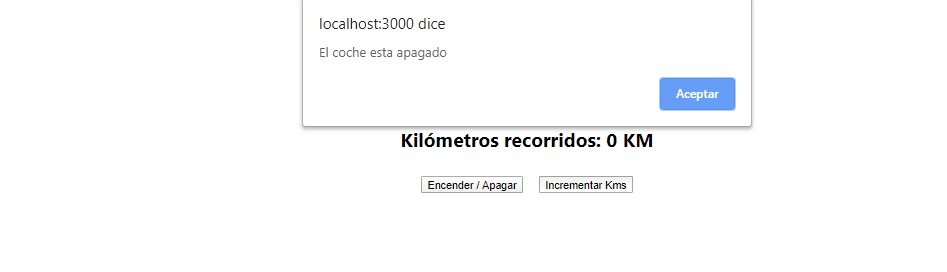
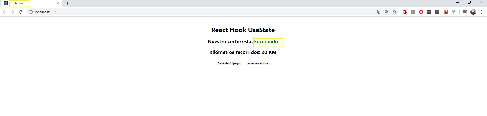

# Realizando un mini curso para aprender lo básico de React
Mini página de pocos componentes aprendiendo sobre el uso de React Hooks con useState y useEffect

## Vistas:
### Apagado

### Mientras esta apagando intentar aumentar Kms

### Encendido y con Kms

## Uso:

Despues de descargar el repositorio, a traves de la linea de comando ejecutar el siguiente script:

**yarn start**

