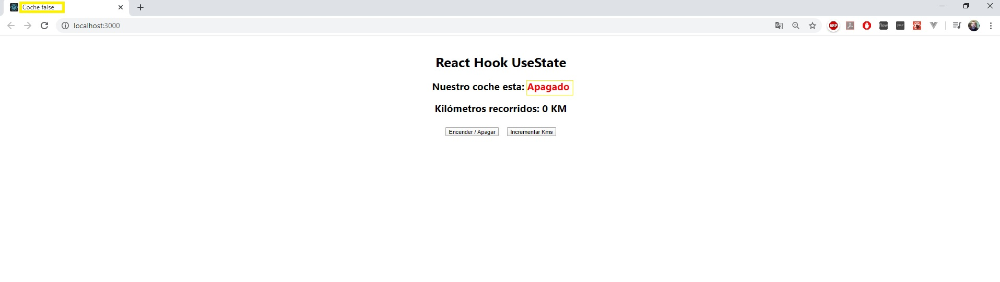

# Realizando un mini curso para aprender lo básico de React
Mini página de pocos componentes aprendiendo sobre el uso de React Hooks con useState y useEffect

## Vistas:

![Encendido](vistas/Encendido.jp

## Uso:

Despues de descargar el repositorio, a traves de la linea de comando ejecutar el siguiente script:

**yarn start**

